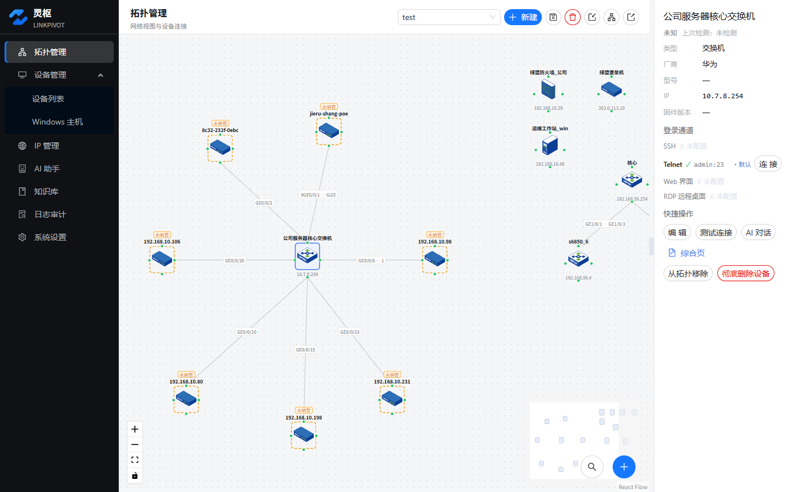
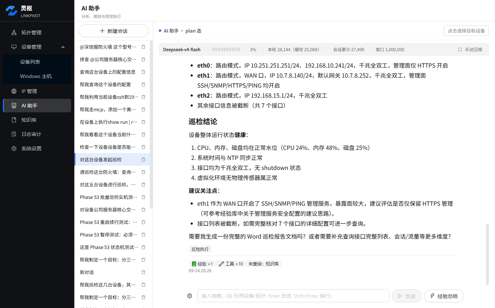
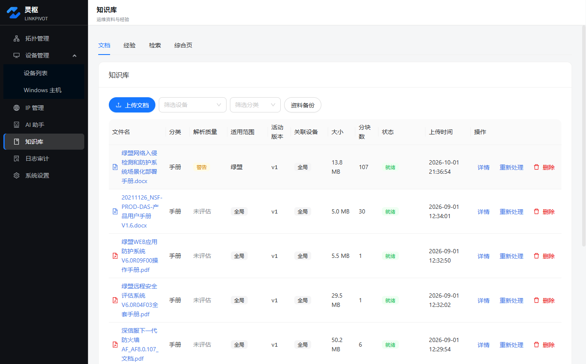
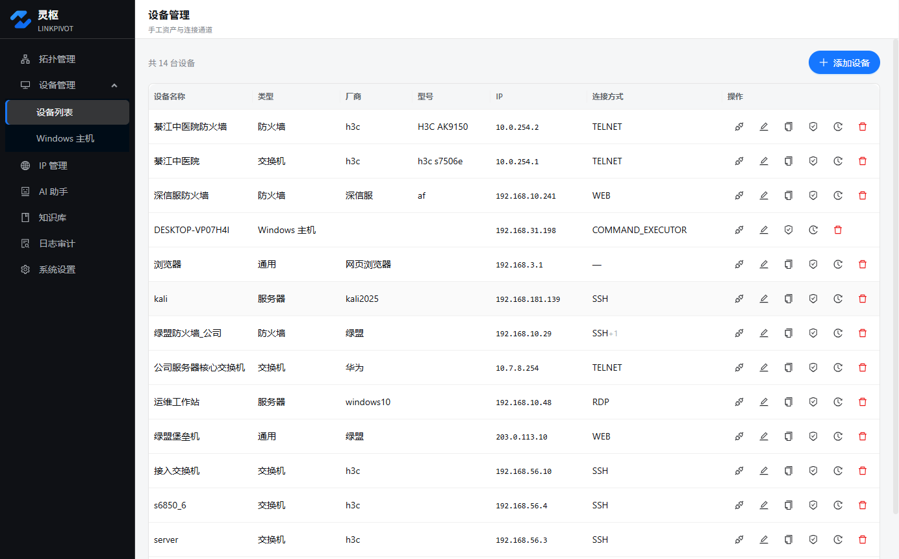

# 灵枢 LinkPivot

**Network topology management + AI ops assistant, in one local-first Windows desktop app.**

**一个工具内：看清网络（拓扑可视化）· 控住设备（四通道远程连接）· 借助 AI（受控 agentic 运维）· 沉淀知识（运维知识库）**

> 📦 本仓库是灵枢的**安装包分发站**（不含源码），应用内自动更新也由本仓库 Releases 承载。
> 🧩 AI 扩展包（防火墙设备 MCP 工具集，490+ 工具）见姊妹仓 [linkpivot-mcp](https://github.com/HaoNan-0331/linkpivot-mcp)。

---

## English

**LinkPivot** is a network topology management & AI operations desktop tool for network engineers (Windows, local-first, no server required):

- **Network topology visualization** — interactive canvas; auto-discovers device connections via SSH (AI analyzes ARP / routing / interface data); auto layout, alignment guides, unknown-device adoption
- **Device management** — inventory with AES-256-GCM field-level encrypted credentials, master key sealed by Windows DPAPI; masked by default in UI
- **Remote sessions** — SSH / Telnet / Web / RDP channels, independent terminal windows per session
- **Agentic AI ops assistant** — multi-step autonomous execution (check status → analyze → configure → verify) under hard limits (step cap / circuit breaker / cooldown / token budget); non-whitelisted or off-target commands are intercepted and require explicit confirmation; answers cite data sources; full audit log
- **MCP extensibility** — import `.mcpb` tool packages (firewall vendor toolkits: NSFOCUS / Hillstone / YAXIN / ASG) to let the AI operate more device types
- **Knowledge base** — PDF/DOCX parsing, chunking, full-text search; turn AI troubleshooting conversations into searchable, traceable experience assets
- **IP / MAC monitoring** — task-based scheduled collection, anomaly detection (new IP / MAC change / IP reuse), OUI vendor lookup, CSV export
- **Local-first & offline** — all data in local SQLite, field-level encrypted, no server, no cloud account

Download `Setup.<version>.exe` from [Releases](../../releases) (NSIS installer, Windows x64).

---

## 为什么做灵枢

做网络的都懂这些痛：

- 设备一多，**拓扑全靠脑记**，连过哪些口凭印象，排障翻三天前的聊天记录
- 每台设备的账号密码**散落在记事本里**，换电脑就丢
- 想让 AI 帮忙查状态、下配置，又**怕它跑飞**——越权命令、跳板横向移动、误操作没法兜底
- 排障经验只在聊天记录里，**人走了经验就走了**

灵枢把这四件事装进一个双击就能装的 Windows 桌面工具，全部数据留在本机。

## ✨ 功能特性

- **拓扑可视化与整理** — React Flow 画布展示网络拓扑；SSH 自动发现设备连接关系（AI 分析 ARP / 路由 / 接口数据推断）；一键星型分层自动布局（全图 / 选区 / 以指定设备为中心）、对齐参考线、拖拽防重叠；连线接口级编辑、未知设备一键纳管、拓扑导入导出
- **设备管理** — 设备台账与凭证管理；凭证 AES-256-GCM 字段级加密，主密钥经 Windows DPAPI 绑定机器落盘，界面默认脱敏；资产一键复制（凭证不继承）；设备命名全局唯一（实时查重 + 存量重名扫描引导）
- **远程连接** — SSH / Telnet / Web / RDP 四类远程通道，独立终端窗口（xterm.js），按窗口隔离会话

- **AI agentic 运维助手** — 按问题类型分档自动检索知识库 / 经验 / 实时设备数据再作答；白名单内多步骤连续自主执行（查状态 → 分析 → 下配置 → 验证，步数 / 熔断 / 冷却 / token 预算四重硬顶）；越权命中即拦截强确认；回答标注数据来源
- **越权防线** — AI 命令目标越权、借道横向移动（ssh / telnet 跳板）、MCP 工具越界三场景检测，聚合强确认 + 全量审计
- **MCP 包扩展** — 导入 .mcpb 工具包扩展 AI 工具面（[防火墙厂商工具集](https://github.com/HaoNan-0331/linkpivot-mcp)：绿盟 / 山石 / 亚信 / 上元信安等，490+ 工具）；manifest 校验 + SHA-256 指纹防投毒，配置绑定设备
- **Windows 主机接入** — 生成主机客户端证书并打包烙印接入（内置 openssl，零外部依赖，供应链 SHA-256 双校验）；主机侧以 Windows 服务常驻回连
- **知识库与经验** — PDF / DOCX 文档解析、自动分章节、全文检索；AI 运维对话一键沉淀为可检索、可溯源的长期经验资产

- **IP / MAC 监控（任务制采集）** — 按「采集任务」圈定设备清单，每任务独立间隔与自动开关；失败指数退避、睡眠唤醒立即补采；新 IP / MAC 变更 / IP 复用异常检测（按观测来源各自跟踪，跨路由视角 / VRRP 多 MAC 不再误告警）；OUI 厂商识别、CSV 导出
- **日志审计** — AI 命令执行全量审计（时间 / 状态 / 设备 / 关键词四维筛选 + 分页）；LLM 原始报文（wire 级）加密记录与查看
- **账号安全** — 登录验证码 + 失败锁定；应用内修改管理员密码；遗忘密码恢复码自助重置
- **应用内自动升级** — 启动检测 GitHub Releases 新版本，应用内下载安装；「不再提醒」三档位

## 📊 与常见方案对比

| | draw.io / Visio | NetBox | OpenWISP | wgcloud | **灵枢** |
|---|---|---|---|---|---|
| 形态 | 画图工具 | Web IPAM/DCIM | Web 网管平台 | Web 监控 | **本地桌面，双击即用** |
| 拓扑 | 手动画、易过期 | 手动录入 | 协议自动采集 | 监控附带图 | **AI 分析 ARP/路由自动发现 + 手动微调** |
| AI 运维 | — | — | — | — | **内置 agent：多步执行+安全闸** |
| 远程连接 | — | — | — | — | **SSH/Telnet/Web/RDP 四通道** |
| 数据位置 | 文件 | 服务端数据库 | 服务端数据库 | 服务端数据库 | **纯本地 + 字段级加密** |
| 部署成本 | 开箱 | Python+PG+Redis | Django 全家桶 | 服务端 + agent | **零依赖安装包** |
| 开源 | ✓ | ✓ | ✓ | ✓ | 闭源免费（非商业） |

> 灵枢不替代 NetBox/OpenWISP 这类服务端平台（多团队 / CMDB 场景它们更强）；它面向的是**单人或小队运维，要一个开箱即用、数据不出本机、还能让 AI 安全帮忙干活**的场景。

## 🚀 下载与快速上手

最新版本 **v1.1.0**（2026-09-26）已发布：[Releases 下载页](../../releases) —— 取 `Setup.1.1.0.exe`（Windows x64，NSIS 安装包），双击安装即可。

| 项 | 说明 |
|----|------|
| 系统 | Windows 10 及以上（x64） |
| 安装 | NSIS 安装包 `Setup.<版本>.exe`，双击安装，可选安装目录与安装范围（当前用户 / 所有用户） |
| 升级 | 应用内自动检查更新（「设置 → 关于」），或到 Releases 覆盖安装——升级**绝不触碰**用户数据 |
| 依赖 | 无需预装运行时（含 Git 等外部工具零依赖），安装包自带全部组件 |
| 数据 | 全部本地存储于 `%APPDATA%\LinkPivot`（SQLite，字段级加密），无需服务端；卸载时默认保留，勾选「同时删除用户数据」才会清除 |

**从 v1.0.x 升级**：应用内检查更新若不可用（旧版更新源限制），直接下载 `Setup.1.1.0.exe` 覆盖安装，数据完整保留。

**首次启动没有默认账号**——应用会引导你创建自己的管理员账号：

1. 首次打开应用，进入「初始化管理员」页面
2. 自定管理员用户名 + 密码（密码至少 10 位，需同时包含字母和数字）
3. 创建后进入登录页，用该账号 + 验证码登录

> 登录连续失败 5 次将锁定 5 分钟；密码可在「设置 → 账号安全」修改，遗忘时可用恢复码重置。

典型使用路径：**设备管理**录入设备与凭证 → **拓扑画布**自动发现 / 手动整理连接关系 → 画布或设备详情一键发起四通道远程连接 → **AI 助手**交代巡检 / 排障任务自主执行 → 结论沉淀**知识库**。

## 🔒 安全设计

- **凭证不出本机**：敏感字段 AES-256-GCM 字段级加密（版本化密文，向后兼容历史数据），主密钥经 Windows DPAPI 保护，渲染层永不接触明文
- **进程隔离 + IPC 鉴权网关**：renderer `contextIsolation` + `sandbox` + `nodeIntegration: false`，仅经 preload 白名单桥接；特权通道登录鉴权 + 异常信息脱敏
- **命令三道闸**：结构校验 → 黑名单硬底 → 设备白名单策略；高危命令强制二次确认；plan 态只读
- **数据可靠**：SQLite WAL + 版本化幂等迁移 + 迁移前自动备份 + 周期备份轮换
- **卸载数据安全**：卸载程序默认保留全部用户数据；仅在你显式勾选「同时删除用户数据」并通过二次确认后才清除，静默卸载与自动升级链结构性绝不删数据

## 📖 使用手册

面向使用者的 **14 章中文手册**随本仓库同步分发：

- 在线阅读：[docs/manual/README.md](docs/manual/README.md)（目录索引：产品概述 / 安装登录 / 界面总览 / 拓扑 / 设备 / IP 管理 / AI 助手 / 知识库 / 日志审计 / 设置 / 远程终端 / 升级 / 速查表 / 术语表）
- 整本下载：[灵枢（LinkPivot）用户手册.docx](docs/manual/灵枢（LinkPivot）用户手册.docx)

> 手册随版本更新同步；每章按「功能概述 / 界面布局 / 逐元素详解 / 规则与限制 / 常见问题」结构编写，界面文案与操作路径均从实际版本摘录。

## 许可

本仓库分发的是**软件安装包，不开放源码**。使用条款见 [LICENSE](LICENSE)：个人学习与非商业运维用途免费使用；商业使用需获得授权。

## 联系

- 问题反馈：[Issues](../../issues)
- 设备支持 / 扩展包需求：[linkpivot-mcp Issues](https://github.com/HaoNan-0331/linkpivot-mcp/issues)

---

**Keywords**: network topology, topology visualization, network management, network operations, AI ops assistant, agentic AI, SSH client, Telnet, RDP, MCP, Model Context Protocol, network automation, device management, network diagram, local-first, offline, Windows desktop, 网络拓扑, 拓扑可视化, 网络运维, 运维工具, 网管软件, 设备管理, AI 运维
